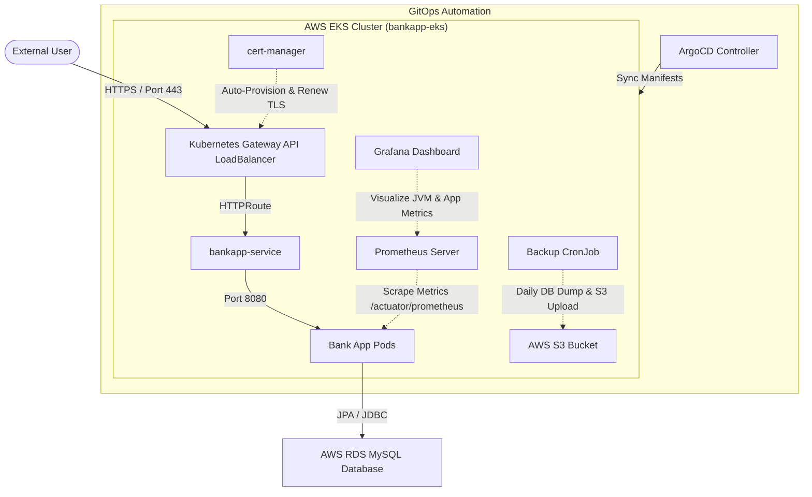

# End-to-End EKS Deployment, DevSecOps, GitOps, SSL & Observability Playbook

This document is a comprehensive, production-grade guide to deploying, securing, monitoring, and backing up the Java Spring Boot Bank Application on AWS EKS. 

---

## 1. System Architecture



---

## 2. Infrastructure Setup & Database Connectivity

### A. AWS RDS MySQL Instance Configuration
The application relies on an external AWS RDS MySQL instance. Ensure the database meets the following parameters:
- **Host Endpoint**: `bankappdb.ckzwyao0w2by.us-east-1.rds.amazonaws.com`
- **Database Name**: `bankappdb`
- **Port**: `3306`
- **Credentials**: Username `admin`, Password `admin123`
- **Network Access**: Ensure the RDS Security Group allows inbound traffic from the EKS Node Security Group on port 3306.
- **Connection Properties**: The application connects using:
  ```properties
  allowPublicKeyRetrieval=true
  createDatabaseIfNotExist=true
  useSSL=false
  ```
  *(These ensure the schema is created automatically and bypasses SSL issues on non-hardened endpoints).*

### B. AWS EKS Cluster Provisioning
1. **Initialize Cluster via `eksctl`**:
   Execute the following command to provision a production-ready Kubernetes cluster across multiple availability zones:
   ```bash
   eksctl create cluster \
     --name bankapp-eks \
     --region us-east-1 \
     --nodegroup-name standard-workers \
     --node-type t3.medium \
     --nodes 2 \
     --nodes-min 1 \
     --nodes-max 3 \
     --managed
   ```
   *Provisioning takes approximately 15–20 minutes.*

2. **Verify Node & Cluster Status**:
   ```bash
   aws eks update-kubeconfig --region us-east-1 --name bankapp-eks
   kubectl get nodes
   ```

---

## 3. Gateway API & Load Balancer Controller Installation

Because EKS does not deploy standard Gateway API controllers by default, you must install the CRDs and an ingress controller (e.g., AWS Load Balancer Controller, Cilium, or Istio) to resolve the `gatewayClassName` specified in the manifests.

### A. Install Gateway API CRDs
Apply the official standard Gateway API CRDs to your cluster:
```bash
kubectl apply -f https://github.com/kubernetes-sigs/gateway-api/releases/download/v1.0.0/standard-install.yaml
```

### B. Deploy AWS Load Balancer Controller
1. **Associate IAM OIDC Provider**:
   ```bash
   eksctl utils associate-iam-oidc-provider --cluster bankapp-eks --approve
   ```
2. **Download & Create IAM Policy**:
   ```bash
   curl -O https://raw.githubusercontent.com/kubernetes-sigs/aws-load-balancer-controller/v2.5.4/docs/install/iam_policy.json
   aws iam create-policy \
       --policy-name AWSLoadBalancerControllerIAMPolicy \
       --policy-document file://iam_policy.json
   ```
3. **Create IAM Role and Service Account**:
   Replace `<AWS_ACCOUNT_ID>` with your actual AWS Account ID:
   ```bash
   eksctl create iamserviceaccount \
     --cluster=bankapp-eks \
     --namespace=kube-system \
     --name=aws-load-balancer-controller \
     --role-name AmazonEKSLoadBalancerControllerRole \
     --attach-policy-arn=arn:aws:iam::<AWS_ACCOUNT_ID>:policy/AWSLoadBalancerControllerIAMPolicy \
     --approve
   ```
4. **Install Controller via Helm**:
   ```bash
   helm repo add eks https://aws.github.io/eks-charts
   helm repo update
   helm install aws-load-balancer-controller eks/aws-load-balancer-controller \
     -n kube-system \
     --set clusterName=bankapp-eks \
     --set serviceAccount.create=false \
     --set serviceAccount.name=aws-load-balancer-controller
   ```

---

## 4. GitOps CD Delivery (ArgoCD)

ArgoCD monitors the repository for changes to Kubernetes manifests under the `k8s/` folder and applies them to the EKS cluster automatically.

### A. Deploy ArgoCD Server
```bash
kubectl create namespace argocd
kubectl apply -n argocd -f https://raw.githubusercontent.com/argoproj/argo-cd/stable/manifests/install.yaml
```

### B. Expose ArgoCD UI and Retrieve Password
1. **Expose via LoadBalancer**:
   ```bash
   kubectl patch svc argocd-server -n argocd -p '{"spec": {"type": "LoadBalancer"}}'
   ```
2. **Fetch external URL**:
   ```bash
   kubectl get svc argocd-server -n argocd
   ```
3. **Get Initial Password**:
   ```bash
   kubectl -n argocd get secret argocd-initial-admin-secret -o jsonpath="{.data.password}" | base64 -d
   ```
   *Login credentials: Username: `admin`, Password: [Retrieved Decoded Value]*

### C. Connect Application Git Repo
Open [k8s/argocd-app.yaml](file:///c:/Users/SHREEG/Downloads/Bank-App/k8s/argocd-app.yaml) and ensure the `repoURL` points to your GitHub Repository. Apply the configuration:
```bash
kubectl apply -f k8s/argocd-app.yaml -n argocd
```

---

## 5. HTTPS SSL/TLS Configuration (Cert-Manager)

Automated provisioning of certificates is managed by Let's Encrypt and cert-manager using the DNS HTTP-01 challenge.

### A. Install Cert-Manager
```bash
helm repo add jetstack https://charts.jetstack.io
helm repo update
kubectl create namespace cert-manager
helm install cert-manager jetstack/cert-manager \
  -n cert-manager \
  --version v1.13.3 \
  --set installCRDs=true
```

### B. Configure DNS Routing and Ingress
1. **Apply the ClusterIssuer**:
   Ensure [k8s/clusterissuer.yaml](file:///c:/Users/SHREEG/Downloads/Bank-App/k8s/clusterissuer.yaml) is configured with your email and apply:
   ```bash
   kubectl apply -f k8s/clusterissuer.yaml
   ```
2. **Fetch LoadBalancer Endpoint**:
   ```bash
   kubectl get svc -n bankapp
   ```
3. **Configure DNS CNAME Record**:
   - Log into your domain registrar (Route 53, Cloudflare, GoDaddy).
   - Create a CNAME record mapping `bank.yourdomain.com` pointing to the external LoadBalancer address of your service/gateway.
4. **Deploy the Gateway Router**:
   ```bash
   kubectl apply -f k8s/gateway.yaml -n bankapp
   ```

---

## 6. Observability Stack (Prometheus & Grafana)

Prometheus scrapes `/actuator/prometheus` inside the application container, while Grafana visualizes JVM telemetry.

### A. Deploy Operator Stack
```bash
helm repo add prometheus-community https://prometheus-community.github.io/helm-charts
helm repo update
kubectl create namespace monitoring
helm install prometheus-stack prometheus-community/kube-prometheus-stack -n monitoring
```

### B. Expose Grafana
```bash
kubectl patch svc prometheus-stack-grafana -n monitoring -p '{"spec": {"type": "LoadBalancer"}}'
kubectl get svc prometheus-stack-grafana -n monitoring
```
- **URL**: [External IP/Host of Grafana LoadBalancer]
- **Default Username**: `admin`
- **Default Password**: `prom-operator`

### C. Connect Service Monitor
Apply the ServiceMonitor target to auto-scrape endpoints labeled with `app: bankapp`:
```bash
kubectl apply -f k8s/servicemonitor.yaml -n bankapp
```

### D. Setup JVM Dashboard
1. Log in to Grafana.
2. Navigate to **Dashboards** -> **Import**.
3. Enter Dashboard ID **`4701`** (JVM Micrometer dashboard).
4. Select the `Prometheus` data source and click **Import**.

---

## 7. Database Backup Automation (CronJob to S3)

A scheduled Job runs a MySQL dump container and uploads the archive directly to AWS S3.

### A. Setup AWS Credentials Secret
If not using IAM Roles for Service Accounts (IRSA), configure static API credentials inside the `bankapp` namespace:
```bash
kubectl create secret generic aws-s3-credentials \
  --from-literal=aws-access-key-id=YOUR_ACCESS_KEY \
  --from-literal=aws-secret-access-key=YOUR_SECRET_KEY \
  -n bankapp
```

### B. Apply CronJob Spec
Ensure you edit the `S3_BUCKET_NAME` property inside [k8s/backup-cronjob.yaml](file:///c:/Users/SHREEG/Downloads/Bank-App/k8s/backup-cronjob.yaml) to match your AWS S3 bucket. Then apply:
```bash
kubectl apply -f k8s/backup-cronjob.yaml -n bankapp
```
*The backup triggers daily at midnight (`0 0 * * *`) and uploads compressed dumps.*

---

## 8. DevSecOps GitHub Actions CI/CD Pipeline

The pipeline triggers on pushes/PRs to `master`, `main`, and `start` branches. It runs static analysis, compilations, containers security audits, and writes image updates to trigger GitOps.

### A. Setting Up Required Secrets in GitHub
To allow the pipeline to run successfully, configure the following secrets under **Settings -> Secrets and variables -> Actions**:

| Secret Name | Description | Example / Link |
| :--- | :--- | :--- |
| `DOCKER_USERNAME` | Docker Hub Account Username | `my-docker-user` |
| `DOCKER_PASSWORD` | Docker Hub Access Token or Password | `dckr_pat_...` |
| `SONAR_TOKEN` | Auth Token from SonarCloud | See setup guide below |
| `SLACK_WEBHOOK` | Incoming Webhook endpoint URL | See setup guide below |

---

### B. Detailed Secret Setup Guides

#### How to Create and Retrieve Your Slack Webhook
If you do not have a Slack Webhook, create one with the following steps:
1. Log in to the [Slack App Directory Console](https://api.slack.com/apps).
2. Click **Create New App** -> Select **From scratch**.
3. Name your app (e.g., `EKS-BankApp-CI`) and choose your Slack **Workspace**. Click **Create App**.
4. In the left-hand sidebar, under **Features**, select **Incoming Webhooks**.
5. Toggle the switch to **Activate Incoming Webhooks** (set to "On").
6. Scroll down and click **Add New Webhook to Workspace**.
7. Select the Slack channel where you want notifications posted (e.g., `#deployments`) and click **Authorize**.
9. Paste this complete URL as the value for `SLACK_WEBHOOK` in your GitHub repository secrets.

#### How to Create and Retrieve Your SonarCloud Token
1. Go to [SonarCloud](https://sonarcloud.io) and log in using your GitHub account.
2. Import or create an Organization matching the workflow configuration (e.g., `vprofile-actions8694`).
3. Click your profile avatar in the top-right corner and select **My Account**.
4. Select the **Security** tab.
5. In the **Generate Tokens** section, enter a descriptive name (e.g., `GitHub-Actions-Pipeline`) and click **Generate**.
6. Copy the generated hexadecimal token immediately (you will not be able to view it again).
7. Save this token as a secret named `SONAR_TOKEN` in GitHub.

---

## 9. Makefile Interface Commands

A `Makefile` is provided in the root directory to simplify deployment and teardown procedures:

- **Initialize environment namespace**:
  ```bash
  make bootstrap
  ```
- **Apply all workloads and configurations to the cluster**:
  ```bash
  make apply
  ```
- **Teardown all Kubernetes resources safely**:
  ```bash
  make destroy
  ```

---

## 10. Troubleshooting & Common Issues Playbook

### 1. SonarCloud returns a `403 Forbidden` or "Project Not Found"
- **Cause**: The Maven project key or organization key does not match your SonarCloud workspace configuration.
- **Fix**: Check `vprofile-actions8694` and `vprofile-actions8694_bankapp` in your pipeline file. Confirm that your `SONAR_TOKEN` secret has not expired and has admin/member scope on the target organization.

### 2. Trivy CLI returns `429 Too Many Requests`
- **Cause**: Trivy makes dynamic calls to download database definitions, hitting Docker Hub or GitHub API rate limits.
- **Fix**: The pipeline compiles dependencies (`mvnw compile`) before calling Trivy to ensure local packages are cached, mitigating external API lookups.

### 3. Let's Encrypt Certificate fails to issue (`bankapp-tls-secret` is empty)
- **Cause**: HTTP-01 challenge fails because DNS resolution of `bank.yourdomain.com` is not propagating, or the Gateway class is unresolved.
- **Fix**: Check the cert-manager logs:
  ```bash
  kubectl logs -n cert-manager -l app=cert-manager -f
  ```
  Ensure your domain's CNAME record is fully resolved via `dig bank.yourdomain.com CNAME` or `nslookup`.

### 4. Database Credentials or Host Refused Connection
- **Cause**: Target endpoint `bankappdb` security group settings blocks EKS pod VPC subnet.
- **Fix**: Verify EKS nodes subnet range (usually `172.31.0.0/16` or similar) is whitelisted in RDS Security group inbound rules on Port 3306.
